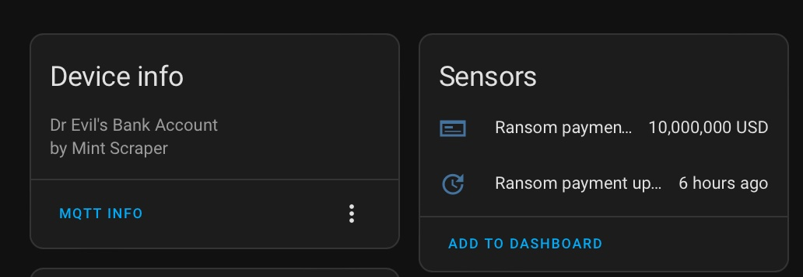
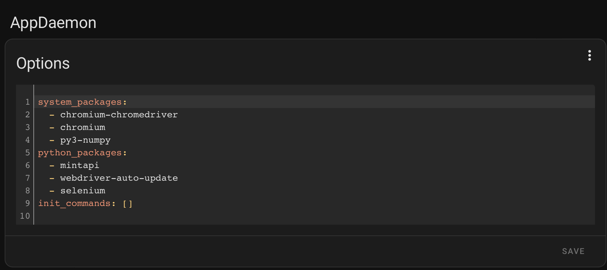
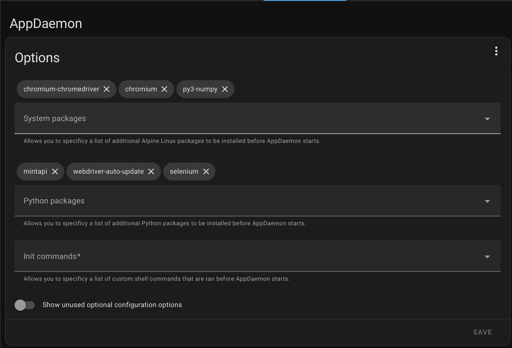
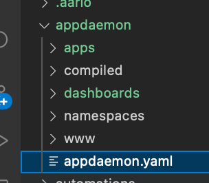
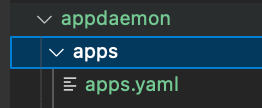

# Mint Financial Data Scraper for Home Assistant (AppDaemon)


This is an [AppDaemon Addon](https://github.com/hassio-addons/addon-appdaemon) for HomeAssistant that will log into a Mint account and scrape bank account data to be sent via MQTT into Home Assistant. It takes advantage of the [`mintapi`](https://github.com/mintapi/mintapi) python project to scrape data and then parses and sends the data over MQTT. Utilizing [MQTT Discovery](https://www.home-assistant.io/integrations/mqtt/#discovery-options) various entities for account balances will be created in HomeAssistant.



[](https://github.com/hacs/integration)
[](https://github.com/jeeftor/mint-scraper-for-homeassistant/actions?query=branch%3Amaster)
[](https://github.com/jeeftor/mint-scraper-for-homeassistant//releases)
[](http://github.com/jeeftor/mint-scraper-for-homeassistant/releases/latest)

## Configuration & Requirements

As this is an AppDaemon integration installation is a bit more complex than other integrations and you will need to make a variety of mods to your configuration files. I suggest you install the [**Studio Code Server**](https://github.com/hassio-addons/addon-vscode/blob/main/README.md) addon to assist in the process.

### 1) - Modify AppDaemon Packages

You will need to ensure both the backing library and a chromium are installed in AppDaemon. You can do this via YAML like:

```yaml
system_packages:
  - chromium-chromedriver
  - chromium
python_packages:
  - mintapi
```

or like



or visually like:



Once you hit save AppDaemon will then install the correct packages.

### Modify various files

Assuming you'v installed the **Studio Code Server** plugin and you can access it from the tool bar click:


to open **Studio Code**.

### Ensure AppDaemon MQTT Plugin

Open the `appdaemon.yaml` file:



and ensure the **MQTT** plugin is enabled. Your configuration may look something like this:

```yaml
---
secrets: /config/secrets.yaml
appdaemon:
  latitude: 52.379189
  longitude: 4.899431
  elevation: 2
  time_zone: Europe/Amsterdam
  plugins:
    HASS:
      type: hass
    MQTT:
      type: mqtt
      verbose: True
      client_host: <MQTT_SERVER_IP>
      client_port: 1883
      client_id: appdaemon_client
      client_user: appdaemon
      client_password: appdaemon
http:
  url: http://127.0.0.1:5050
admin:
api:
hadashboard:
```

_Please refer to [AppDaemon documentation](https://appdaemon.readthedocs.io/en/latest/CONFIGURE.html) for help_

### Store MINT Secrets

Open the `secrets.yaml` file and add the following information:

```yaml
mint_mfa_token: <SEED_FOR_MFA_TOKEN>
mint_password: <PASSWORD_FOR_MINT>
mint_email: <EMAIL_FOR_MINT>
```

_Refer to the [mintapi backing library](https://github.com/mintapi/mintapi#option-1-totp) for how to configure your `mint_mfa_token`_

### Lastly its time to create an App Description

Open the `apps.yaml` file:



and add the following application description:

```yaml
mint-scraper-for-home-assistant:
  module: mint_scraper
  class: MintScrapperApp
  mint_mfa_token: !secret mint_mfa_token
  mint_password: !secret mint_password
  mint_email: !secret mint_email
```

| key              | optional | type   | description                                    |
| ---------------- | -------- | ------ | ---------------------------------------------- |
| `module`         | False    | string | The module name of the app.                    |
| `class`          | False    | string | The name of the Class.                         |
| `mint_email`     | False    | string | Email address registered with mint.            |
| `mint_password`  | False    | string | The associated password.                       |
| `mint_mfa_token` | False    | string | Seed to generate Time based One-Time password. |

## Verifying Installation

Next you can verify the installation one of two ways:

1. Navigate to the AppDaemon admin interface on: http://<HomeAssistant-URL/IP>:5050
2. Open the AppDaemon Addon and view the log files
